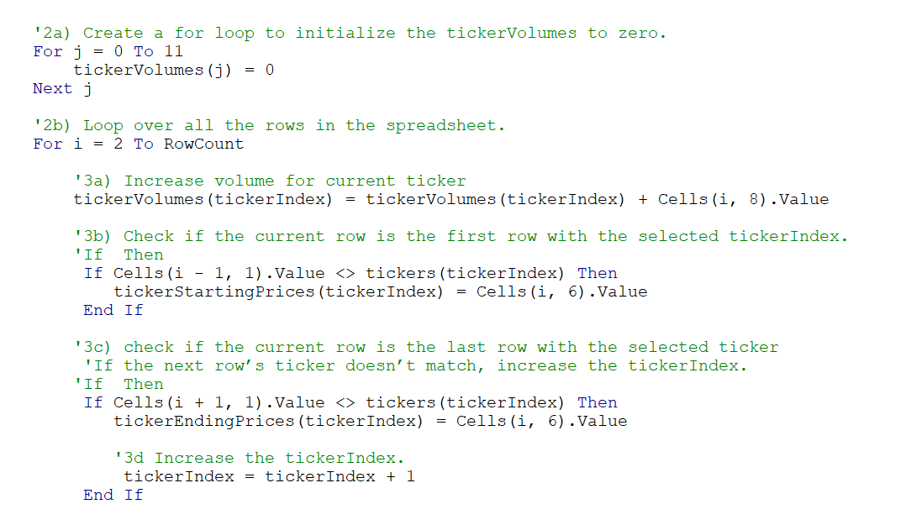
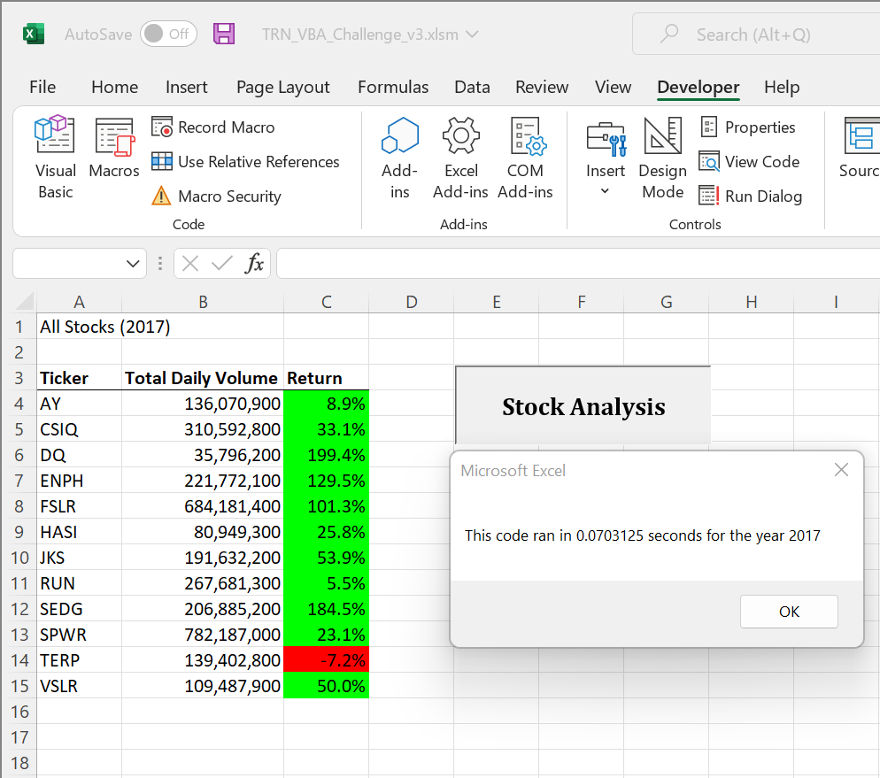
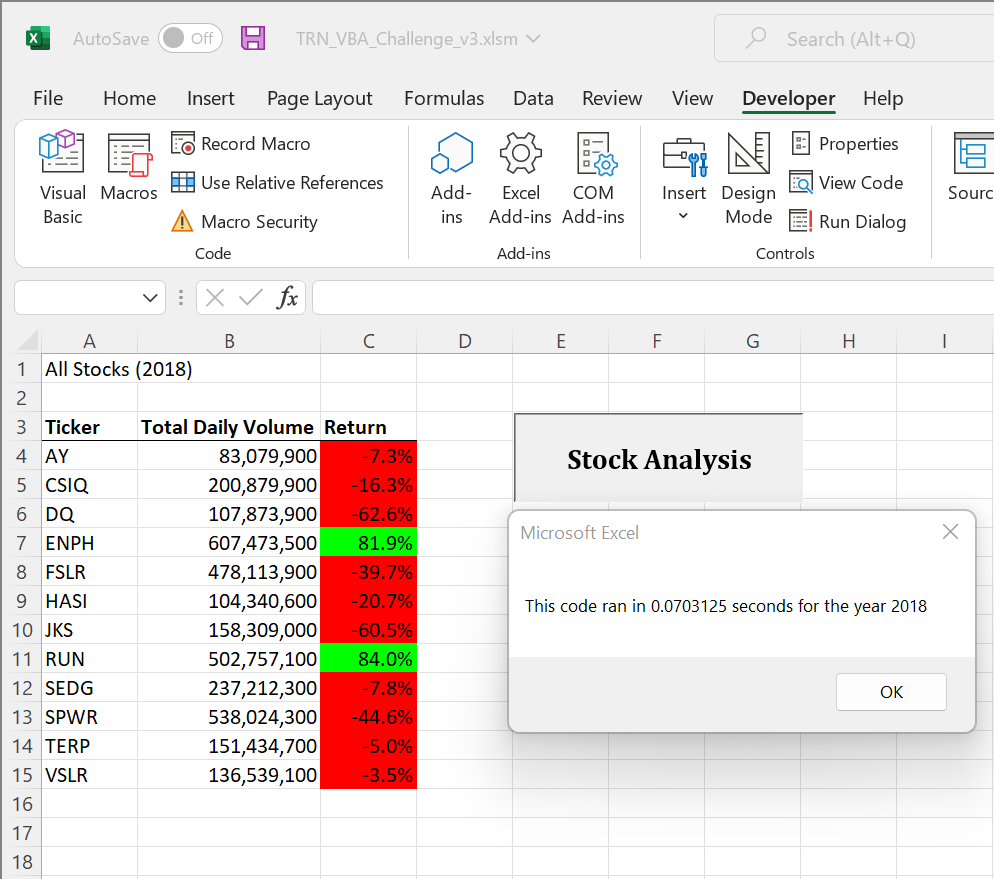

# Module 2 Challenge: VBA Challenge

## Overview of Project

The overview or goal of this project is to refactor VBA code to make it more efficient while returning the same results as the less efficient code written in the module.  The more specific purpose of the new VBA code is to reduce the number of times the VBA script loops through the data.  The reduction of the number of times the code loops through the data should drastically improve performance.   For the purposes of this write-up, the “old” code refers to the VBA code created throughout the module on the “green_stocks” excel file.  The run time was never less than 0.5 seconds, the code tested did not format the data, and it only ran through 2018 data.  The same computer was used to get the 0.5 second run time with the old code and the results from the refactored VBA code on the 2017 and 2018 data.  

### Results

Given the assignment is about the performance of the code and not the stocks, analysis and observations will not be given in detail.  The one simple observation about the stocks is that most preformed well in 2017 but only two showed growth in 2018 (ENPH and RUN).  The functionality of the assignment happens mainly in steps 2 and 3 (the other steps are essential for the code to function, but the gathering of information happens in 2 and 3).  The code from the VBA for 2 and 3 is below.  The code goes through the data set, sums the daily volume of each stock, finds the starting price, and finds the ending price for each stock symbol.  The “for loop” and nested “if then” statements reduce the number of times the code has to go through the data set and increases efficiency.  

The refactored code runs at times much faster than the “old” code, reducing from a 0.5 second run time to ~0.07 for 2017 and 2018.  

## Summary
The reduction of run time would allow for less system resources to be used to provide the same result and would allow for larger data sets to be utilized while not challenging the operating computer.  As mentioned earlier, the refactored code can run for 2017 or 2018 and has conditional formatting built in to the display meaning, in short the refactored code does more faster than the “old” code. 

### What are the advantages or disadvantages of refactoring code

Intrinsic in the name of refactoring code is the assumption that the original code preforms as expected, or else it would be referred as something different like debugging code.  Using this thought as a starting point a disadvantage of refactoring code is the potential that the new code no longer preforms as expected.  The new code could return in accurate results, or the amount of time and effort put into the refactored code is not worth the benefit gained (the old adage that the juice is not worth the squeeze).  It is also possible that the refactored code preforms more efficiently and with the expected results but runs into more errors depending on other factors not directly considered in the refactoring.  Despite the risks, refactoring has tremendous upside.  Refactoring can create cleaner, more efficient, better documented code that can increase performance and functionality.  Refactoring code can also allow old code to be brought up to current best practices.   

### How do the advantages or disadvantages of refactoring code apply to the original VBA script

In relation to this exercise and my completion of it the advantages outweighed the disadvantages excluding the learning aspect of the module.  The disadvantages were apparent when the original attempt at refactoring did not succeed, the results were in accurate, and that was after the code was able to run without bugs or crashing. (This is v3 of the VBA_Challenge, suggesting several attempts so futile that I decided to start completely over).  However, the final product has increased functionality, quicker runtimes, and the same expected results.  The refactored code utilized a “for loop” and “if then” statements to create code that is easier to read, easier for another party to edit, and with better performance. 